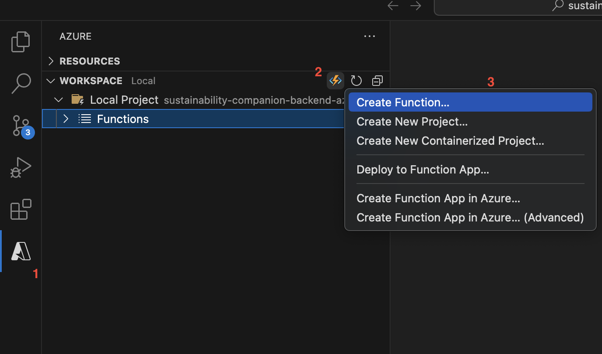
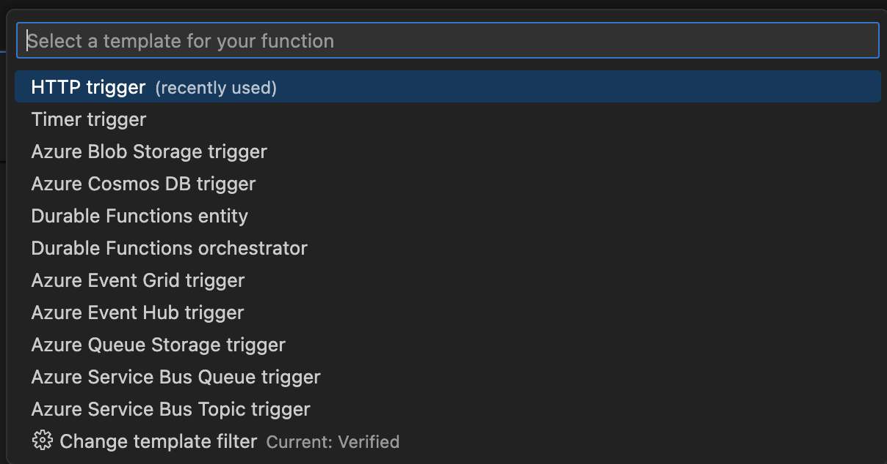
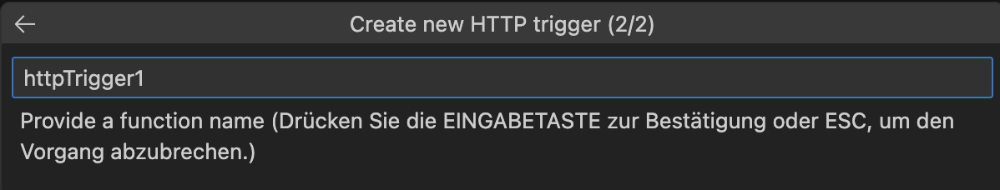
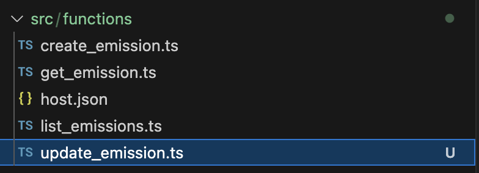
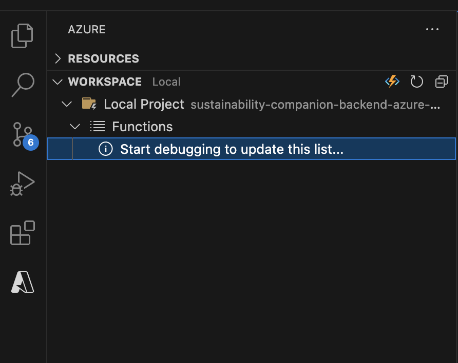
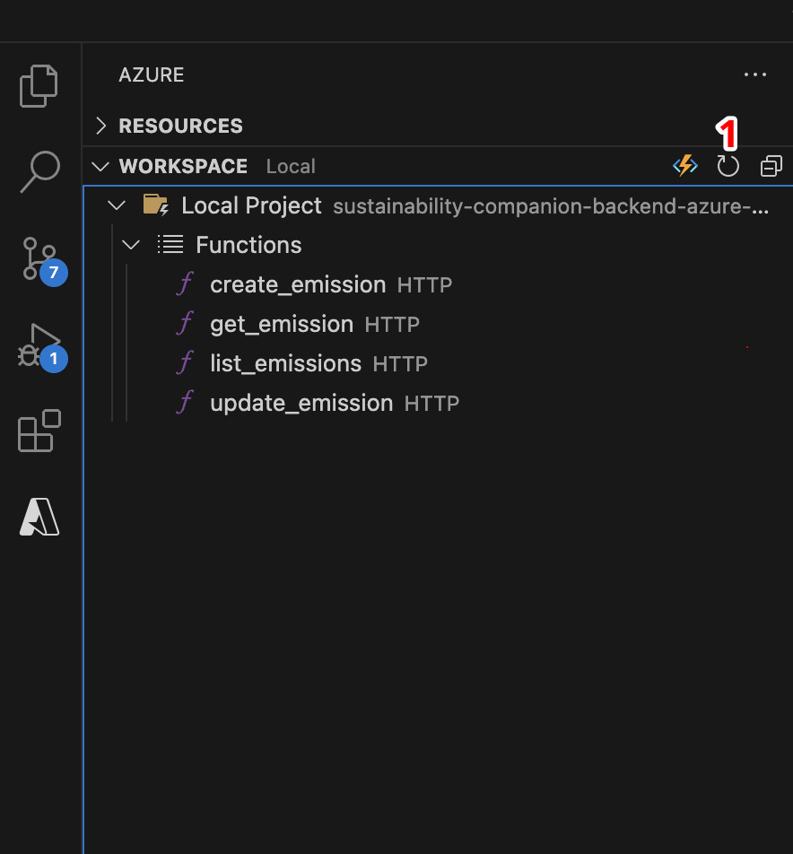
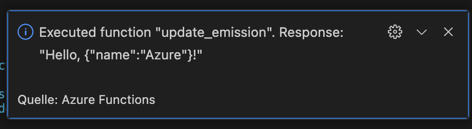
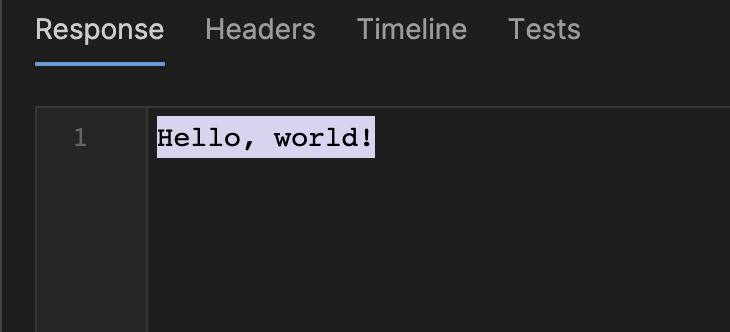
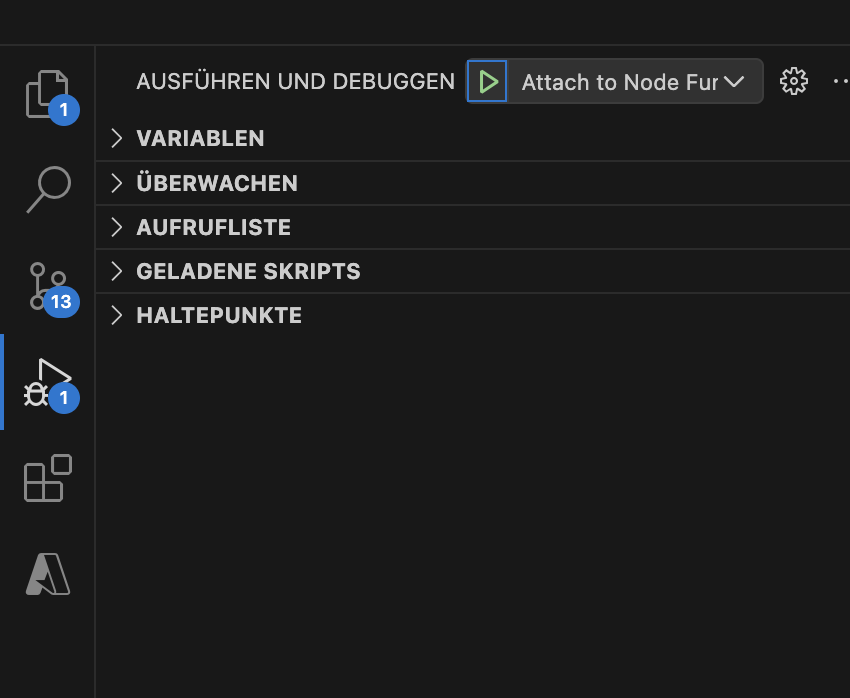

## Prerequisites:

GIT: (https://git-scm.com/)    
VS Code: (https://code.visualstudio.com/)    
VS Code Extension: (https://marketplace.visualstudio.com/items?itemName=ms-azuretools.vscode-azurefunctions)    
NodeJS: Version 18 (https://nodejs.org/en/download/releases/)    
Typescript: (npm install typescript --save-dev)    
Azure Core Function Tools v4: (https://docs.microsoft.com/de-de/azure/azure-functions/functions-run-local)    
Create an Azure Students Account: (https://azure.microsoft.com/de-de/free/students/)

Optional: 
API Tool: https://www.postman.com/ or https://www.usebruno.com/    
Azure Account: https://azure.microsoft.com/de-de/free/students/

## How Tos 
### Create A Function

After installing the **Azure Functions Extension**, select the Azure image on the left menu *(1)*. Under **workspace** select the function image *(2)* and select **Create Function** in the index tab *(3)*.

For this task you need to select **HTTP Trigger**.

Name your function (f.e. *update_emission*).

You can find your new Function in the **src/functions** direction.

### Run a Function

Select the **Azure Funtions Extension** and double click to start debugging. 

If the debugging process was successful, you can select the function you want to run. Reload if nessecary *(1)*.
To Execute the default Code in your new Function, right click on the function and select **Execute Function now**.

Enter the request body (Default: *{ "name": "Azure" }*)
And you will see a small Pop Up in the bottom right corner.

To see the message use an **API Tool** or open a browser window and send a GET or POST request (*default*) to see the message 

For further testing you will only need to select the *run and debug* tab to run your funtions and use an **API Tool** or your Web Browser to see the requests. 

**Happy Coding!**